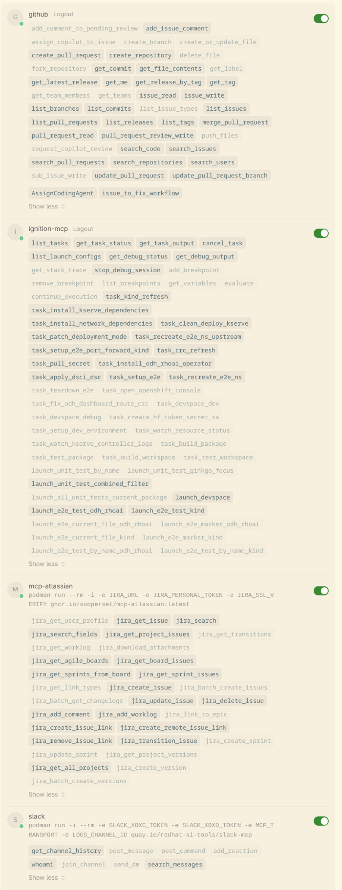

# 🤖 KServe Agentic Prompts

AI agent rules and commands for developing KServe on OpenShift. Companion to [kserve-workspace](https://github.com/jlost/kserve-workspace).

## 🚀 Setup

1. Clone [kserve-workspace](https://github.com/jlost/kserve-workspace) as `.vscode`:
    ```sh
    cd kserve
    git clone git@github.com:jlost/kserve-workspace.git .vscode
    ```

2. Clone this repo as `.cursor`:
    ```sh
    git clone git@github.com:jlost/kserve-prompts.git .cursor
    ```

3. Symlink global rules (one-time):
    ```sh
    mkdir -p ~/.cursor/rules
    ln -sf "$(pwd)/.cursor/global-rules/odh-fork-structure.mdc" ~/.cursor/rules/
    ```

4. Configure MCP servers - set env vars in `~/.zshenv`:
    ```sh
    export GITHUB_MCP_TOKEN="ghp_xxxx"
    export JIRA_URL="https://issues.redhat.com"
    export JIRA_PERSONAL_TOKEN="your-token"
    # Slack integration (extract from browser cookies)
    # See: https://github.com/maorfr/slack-token-extractor
    export SLACK_XOXC_TOKEN="xoxc-xxxx"
    export SLACK_XOXD_TOKEN="xoxd-xxxx"
    ```
    Then run: `.cursor/scripts/setup-mcp.sh`

5. Start Cursor: `cursor .`

## 📦 Contents

- **`rules/`** - Context rules for the AI (fork structure, git workflow, testing, etc.)
- **`global-rules/`** - Cross-repo rules to symlink to `~/.cursor/rules/`
- **`commands/`** - Slash commands (WIP)

## 🔧 MCP Tool Settings

The `mcp.json` spec doesn't yet support specifying which tools are enabled/disabled. Until then, manually configure your Cursor MCP settings to match:



## 🤝 Contributing

**Live with changes before proposing them.** Use new rules for at least a week across varied tasks before submitting a PR. Prompt engineering is empirical - what seems like an improvement may not work in practice.
