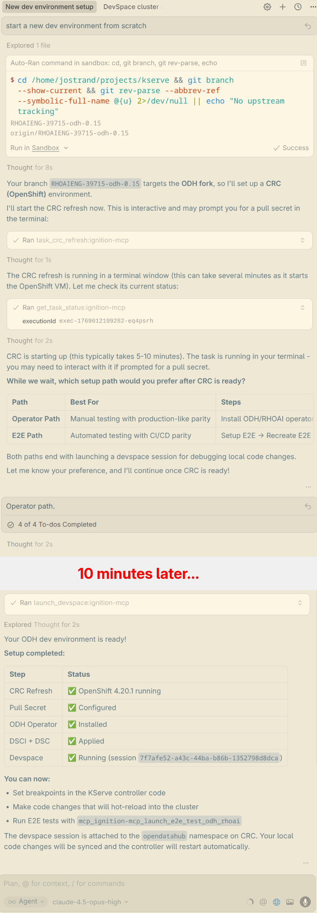

<a href="./kserve-agent.png"></a>

# Model Serving Agentic Prompts

AI agent rules and commands for developing the RHOAI Model Serving stack (kserve + odh-model-controller) on OpenShift.

## Workspace Structure

```
model-serving/              # Workspace root -- open Cursor here
├── .cursor/                # This repo (agentic prompts)
├── kserve/                 # kserve repo
├── odh-model-controller/   # odh-model-controller repo
└── .vscode/                # Optional: kserve-workspace
```

## Setup

1. Create the workspace directory and clone repos:
    ```sh
    mkdir -p ~/projects/model-serving && cd ~/projects/model-serving
    git clone git@github.com:<you>/kserve.git kserve
    git clone git@github.com:<you>/odh-model-controller.git odh-model-controller
    ```

2. Clone this repo as `.cursor`:
    ```sh
    git clone git@github.com:jlost/kserve-prompts.git .cursor
    ```

3. Optionally clone [kserve-workspace](https://github.com/jlost/kserve-workspace) as `.vscode`:
    ```sh
    git clone git@github.com:jlost/kserve-workspace.git .vscode
    ```

4. Configure MCP servers -- set env vars in `~/.zshenv`:
    ```sh
    export GITHUB_MCP_TOKEN="ghp_xxxx"
    # Slack integration (extract from browser cookies)
    # See: https://github.com/maorfr/slack-token-extractor
    export SLACK_XOXC_TOKEN="xoxc-xxxx"
    export SLACK_XOXD_TOKEN="xoxd-xxxx"
    ```
    Then run: `.cursor/scripts/setup-mcp.sh`

    **Note:** Jira/Confluence uses the official [Atlassian Rovo MCP Server](https://github.com/atlassian/atlassian-mcp-server) with OAuth 2.1. On first use, a browser window opens for Atlassian login. No tokens needed.

5. Start Cursor from the workspace root: `cursor ~/projects/model-serving`

## Contents

- **`rules/`** - Context rules for the AI (workspace layout, fork structures, git workflow, testing, etc.)
- **`commands/`** - Slash commands (jira-work, rhoai-cve, spinoff-pr, etc.)
- **`skills/`** - Reusable skill definitions (dev-environments, jira-github-workflow, etc.)

## MCP Servers

| Server | Auth | Description |
|--------|------|-------------|
| `github` | Token (env var) | GitHub Copilot MCP |
| `mcp-atlassian` | OAuth 2.1 (browser) | [Atlassian Rovo](https://github.com/atlassian/atlassian-mcp-server) - Jira + Confluence |
| `slack` | Cookies (env var) | Slack MCP via Podman |

## Contributing

**Live with changes before proposing them.** Use new rules for at least a week across varied tasks before submitting a PR. Prompt engineering is empirical -- what seems like an improvement may not work in practice.
